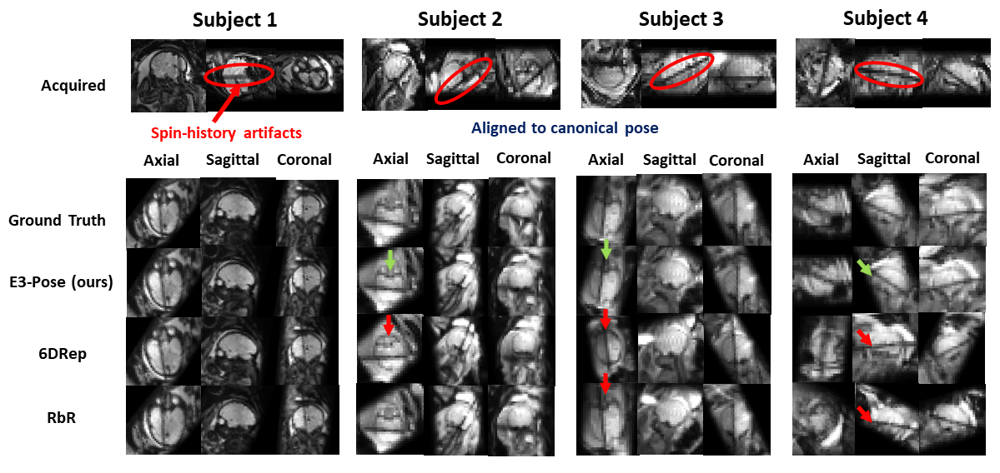

# E3-Pose

In this repository, we present E3-Pose, the first framework for 3D canonical rigid pose estimation from volumetric medical images that uses an $E(3)$-equivariant convolutional neural network (E3-CNN). Although we evaluate the utility of E3-Pose on fetal brain MRI for the application of automated slice prescription, the proposed methods are applicable more broadly.

We rapidly estimate pose from volumes in a two-step process that separately estimates translation and rotation:

1. Translation Estimation:
    * A standard segmentation U-Net localizes the object in the volume.
    * The center-of-mass (CoM) of the predicted mask is the estimated origin of the canonical coordinate frame. 
2. Rotation Estimation:
    * We crop input volumes such that the predicted segmentation mask is scaled to 60% of the cropped dimensions.
    * The E3-CNN takes in the cropped volume as input, and outputs a 9D rotation representation consisting of 2 vectors and 1 pseudovector.
    * The final output rotation to the canonical coordinate frame is computed by choosing the pseudovector direction that ensures right-handedness, and orthonormalizing via support-vector decomposition (SVD).

Our E3-CNN architecture builds on prior theoretical work on [3D steerable CNNs](https://proceedings.neurips.cc/paper_files/paper/2018/file/488e4104520c6aab692863cc1dba45af-Paper.pdf) and uses code borrowed from [e3nn-UNet](https://github.com/SCAN-NRAD/e3nn_Unet), which implements 3D convolutions with the [e3nn](https://e3nn.org/) Python library for building $E(3)$-equivariant networks.

 

 

Overall, E3-Pose outperforms state-of-the-art methods for rigid pose estimation in fetal brain MRI, including strategies that rely on classical optimisation ([ANTs](https://github.com/ANTsX/ANTs)1), anatomical landmark detection ([Fetal-Align](https://github.com/mu40/fetal-align)), keypoint detection ([EquiTrack](https://github.com/BBillot/EquiTrack)), and direct pose regression with standard CNNs ([6DRep](https://www.spiedigitallibrary.org/conference-proceedings-of-spie/12464/124640T/Automatic-brain-pose-estimation-in-fetal-MRI/10.1117/12.2647613.full), [RbR](https://github.com/HuXiaoling/Regre4Regis)). See figure below for rigid pose estimation in low-SNR volumes with severe artifacts. Particularly, we show in our paper that regularizing network parameters to conform with the physical symmetry of rigid pose estimation mitigates overfitting and permits better generalization to out-of-distribution data.

 

 

The full article describing this method is available at:

**E3-Pose: Equivariant Rigid Pose Estimation With Application to Slice Prescription in Fetal Brain MRI** \
Muthukrishnan, Billot, Gagoski, Soldatelli, Grant, Golland

---
### Installation

1. Clone this repository.
2. Install python 3.10.
3. Install all the [required libraries](requirements.txt).
4. If you want to use our trained model weights for fetal brain MRI, download the model weights [here](https://drive.google.com/drive/folders/1r6FVzXG9VLH-0MtMnD2hwjzdDqss1DSE?usp=sharing).

You're now ready to use E3-Pose!

 

---
### Train and test your own networks

This repository contains all the code necessary to train and test your own networks. We provide separate scripts for training the segmentation U-Net and E3-CNNs, and a single script to deploy both for full rigid pose estimation.

To better explain the training and testing procedures, we have writen corresponding tutorials, which were conceived to
be read in order.

- [train_unet.py](scripts/train_unet.py) explains how to train the segmentation U-Net for translation estimation.
- [train_e3cnn.py](scripts/train_e3cnn.py) explains how to train the E3-CNN for rotation estimation.
- [inference.py](scripts/inference.py) explains how to run inference on an input volume given trained model weights for both networks.

 

---
### Citation/Contact

This code is under [Apache 2.0](LICENSE.txt) licensing.

If you find this work useful for your research, please cite:

**E3-Pose: Equivariant Rigid Pose Estimation With Application to Slice Prescription in Fetal Brain MRI** \
Muthukrishnan, Billot, Gagoski, Soldatelli, Grant, Golland

If you have any question regarding the usage of this code, or any suggestions to improve it, please raise an issue
(preferred) or contact us at:\
**ramyamut@mit.edu**

 

---
### References

1 *3D Steerable CNNs: Learning Rotationally Equivariant Features in Volumetric Data* \
Weiler, Geiger, Welling, Boomsma, Cohen \
Advances in Neural Information Processing Systems, 2018

2 *Leveraging SO(3)-steerable convolutions for pose-robust semantic segmentation in 3D medical data* \
Diaz, Geiger, McKinley \
Journal of Machine Learning in Biomedical Imaging, 2024

3 *e3nn: Euclidean neural networks* \
Geiger and Smidt \
arXiV, 2022

4 *A reproducible evaluation of ANTs similarity metric performance in brain image registration* \
Avants, Tustison, Song, Cook, Klein, Gee \
NeuroImage, 2011

5 *Rapid head-pose detection for automated slice prescription of fetal-brain MRI* \
Hoffmann, Abaci Turk, gagoski, Morgan, Wighton, Tisdall, Reuter, Adalsteinsson, Grant, Wald, van der Kouwe \
International Journal of Imaging Systems and Technology, 2021

6 *SE(3)-Equivariant and Noise-Invariant 3D Rigid Motion racking in Brain MRI* \
Billot, Dey, Moyer, Hoffmann, Abaci Turk, Gagoski \
IEEE Transactions on Medical Imaging, 2024

7 *Automatic brain pose estimation in fetal MRI* \
Faghihpirayesh, Karimi, Erdogmus, Gholipour \
Proceedings of SPIE: Medical Imaging: Image Processing, 2023

8 *Registration by Regression (RbR): a framework for interpretable and flexible atlas registration* \
Gopinathm Hum Hoffmnn, Puonti, Iglesias \
International Workshop on Biomedical Image Registration, 2024
