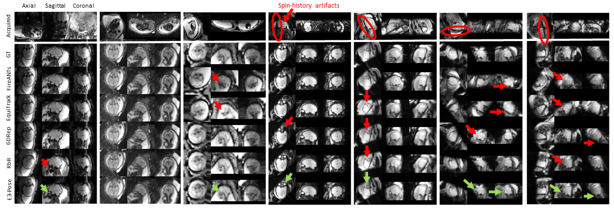

# E(3)-Pose

In this repository, we present E(3)-Pose, the first symmetry-aware framework for 6-DoF object pose estimation from volumetric images that uses an E(3)-equivariant convolutional neural network (E(3)-CNN). Although we evaluate the utility of E(3)-Pose on fetal brain MRI, the proposed methods hold potential for broader applications.

<br />


<br />

We rapidly estimate pose from volumes in a two-step process that separately estimates translation and rotation:

1. **Translation Estimation:**
    * A standard segmentation U-Net localizes the object in the volume.
    * The center-of-mass (CoM) of the predicted mask is the estimated origin of the canonical object coordinate frame. 
2. **Rotation Estimation:**
    * We crop input volumes such that the predicted segmentation mask is scaled to 60% of the cropped dimensions.
    * The E(3)-CNN takes in the cropped volume as input, and outputs an E(3)-equivariant rotation parametrization consisting of 2 vectors and 1 pseudovector.
    * The output rotation is computed by choosing the pseudovector direction that ensures right-handedness, and orthonormalizing via support-vector decomposition (SVD).

Our E(3)-CNN architecture builds on prior theoretical work on [3D steerable CNNs](https://proceedings.neurips.cc/paper_files/paper/2018/file/488e4104520c6aab692863cc1dba45af-Paper.pdf)<sup>1</sup> and uses code borrowed from [e3nn-UNet](https://github.com/SCAN-NRAD/e3nn_Unet)<sup>2</sup>, which implements 3D convolutions with the [e3nn](https://e3nn.org/)<sup>3</sup> Python library for building E(3)-equivariant networks.

<br />


<br />

Overall, E(3)-Pose outperforms state-of-the-art methods for pose estimation in fetal brain MRI volumes representative of clinical applications, 
including strategies that rely on anatomical landmark detection ([Fetal-Align](https://github.com/mu40/fetal-align)<sup>4</sup>), 
template registration ([FireANTs](https://github.com/rohitrango/FireANTs)<sup>5</sup> and [EquiTrack](https://github.com/BBillot/EquiTrack)<sup>6</sup>), and direct pose regression with standard CNNs ([3DPose-Net](https://github.com/SadeghMSalehi/DeepRegistration)<sup>7</sup>, [6DRep](https://www.spiedigitallibrary.org/conference-proceedings-of-spie/12464/124640T/Automatic-brain-pose-estimation-in-fetal-MRI/10.1117/12.2647613.full)<sup>8</sup>, [RbR](https://github.com/HuXiaoling/Regre4Regis)<sup>9</sup>). 
See figure below for example results. Particularly, we show in our paper that regularizing network parameters to conform with physical symmetries mitigates overfitting to research-quality training datasets, and permits better generalization to out-of-distribution clinical data with pose ambiguities.

<br />



<br />

The full article describing this method is available at:

**Equivariant Symmetry-Aware Head Pose Estimation for Fetal MRI** \
Muthukrishnan, Lee, Grant, Adalsteinsson, Gagoski, Billot, Golland

---
### Installation

1. Clone this repository.
2. Install python 3.10.
3. Install all the [required libraries](requirements.txt).
4. If you want to use our trained model weights for fetal brain MRI, download the model weights [here](https://drive.google.com/drive/folders/1r6FVzXG9VLH-0MtMnD2hwjzdDqss1DSE?usp=sharing).
5. If you want to train your own network on a [publicly available fetal MRI dataset](https://pubmed.ncbi.nlm.nih.gov/40800813/)<sup>10</sup>, download our manually annotated segmentations and poses [here](https://drive.google.com/file/d/1yO2o2sNNNEfcB_-ZDcVvHyCGxqk6SYyE/view?usp=sharing).

You're now ready to use E(3)-Pose!

<br />

---
### Usage

This repository contains all the code necessary to train and test your own networks. We provide separate scripts for training the segmentation U-Net and E(3)-CNNs, and a single script to deploy both for full rigid pose estimation.

#### Training a Segmentation U-Net for Translation Estimation

1. Set up separate training/validation dataset directories for images and ground-truth segmentation labels, where file names between image and label directories are the same. Ensure that all image file extensions are .nii or .nii.gz.

2. If you are training a multi-class segmentation network, ensure that the object for which you want to estimate pose has category label 1 in the ground-truth labels.

3. Name the output directory to save all model weights and metrics during network training.

4. To train the segmentation U-Net, run:

    ```
    python scripts/train_unet.py train_image_dir/ train_label_dir/ val_image_dir/ val_label_dir/ output_dir/
    ```

    For detailed descriptions of other arguments, run:
    
    ```
    python scripts/train_unet.py -h
    ```

#### Training an E(3)-CNN for Rotation Estimation

1. Set up separate training/validation dataset directories for images and ground-truth segmentation labels, where file names between image and label directories are the same. Ensure that all image file extensions are .nii or .nii.gz. If your segmentation labels have multiple classes, ensure that the object for which you want to estimate pose has category label 1.

2. Set up separate CSV files for rotation annotations in training and validation datasets, in the following format:

    | frame_id | rot_x | rot_y | rot_z |
    |----------|-------|-------|-------|
    | ...      | ...   | ...   | ...   |

    where **frame_id** is the file name of the volume without the file extension, and **rot_x**, **rot_y**, **rot_z** are the Euler angles in degrees of the rotation from the volume to the canonical coordinate frame. The Euler angle rotation assumes the "xyz" ordering convention.

3. Name the output directory to save all model weights and metrics during network training.

4. To train the E(3)-CNN, run:

    ```
    python scripts/train_e3cnn.py train_image_dir/ train_label_dir/ path_to_train_annotations.csv \
        val_image_dir/ val_label_dir/ path_to_val_annotations.csv \
        output_dir/
    ```

    For detailed descriptions of other arguments, run:
    
    ```
    python scripts/train_e3cnn.py -h
    ```

#### Running Rigid Pose Estimation with Trained Model Weights

1. Set up an input directory of images (all file extensions must be .nii or .nii.gz) on which to run rigid pose estimation.

2. Name the output directory to save all estimated poses.

3. To estimate pose on all inputs, run:

    ```
    python scripts.inference.py input_image_dir/ output_dir/ path_to_segmentation_unet.ckpt path_to_e3cnn.pth
    ```

    For detailed descriptions of other arguments, run:
    
    ```
    python scripts/inference.py -h
    ```

4. Output poses are saved as 4x4 transform matrices in .npy format in the output directory, where file names are the same as the inputs.

<br />

---
### Citation/Contact

If you find this work useful for your research, please cite:

**Equivariant Symmetry-Aware Head Pose Estimation for Fetal MRI** \
Muthukrishnan, Lee, Grant, Adalsteinsson, Gagoski, Billot, Golland

If you have any question regarding the usage of this code, or any suggestions to improve it, please raise an issue
(preferred) or contact us at:\
**ramyamut@mit.edu**


<br />

---
### References
<sup>1</sup> *3D Steerable CNNs: Learning Rotationally Equivariant Features in Volumetric Data* \
Weiler, Geiger, Welling, Boomsma, Cohen \
Advances in Neural Information Processing Systems, 2018

<sup>2</sup> *Leveraging SO(3)-steerable convolutions for pose-robust semantic segmentation in 3D medical data* \
Diaz, Geiger, McKinley \
Journal of Machine Learning in Biomedical Imaging, 2024

<sup>3</sup> *e3nn: Euclidean neural networks* \
Geiger and Smidt \
arXiV, 2022

<sup>4</sup> *Rapid head-pose detection for automated slice prescription of fetal-brain MRI* \
Hoffmann, Abaci Turk, Gagoski, Morgan, Wighton, Tisdall, Reuter, Adalsteinsson, Grant, Wald, van der Kouwe \
International Journal of Imaging Systems and Technology, 2021

<sup>5</sup> *FireANTs: Adaptive Riemannian optimization for multi-scale diffeomorphic registration* \
Jena, Chaudhari, Gee \
arXiV, 2024

<sup>6</sup> *SE(3)-Equivariant and Noise-Invariant 3D Rigid Motion racking in Brain MRI* \
Billot, Dey, Moyer, Hoffmann, Abaci Turk, Gagoski \
IEEE Transactions on Medical Imaging, 2024

<sup>7</sup> *Real-time Deep Pose Estimation with Geodesic Loss for Image-to-Template Rigid Registration* \
Salehi, Khan, Erdogmus, Gholipour \
IEEE Transactions on Medical Imaging, 2019

<sup>8</sup> *Automatic brain pose estimation in fetal MRI* \
Faghihpirayesh, Karimi, Erdogmus, Gholipour \
Proceedings of SPIE: Medical Imaging: Image Processing, 2023

<sup>9</sup> *Registration by Regression (RbR): a framework for interpretable and flexible atlas registration* \
Gopinath, Hu, Hoffmann, Puonti, Iglesias \
International Workshop on Biomedical Image Registration, 2024

<sup>10</sup> *The developing human connectome project fetal functional MRI release: methods and data structures* \
Karolis et al \
Imaging Neuroscience, 2025